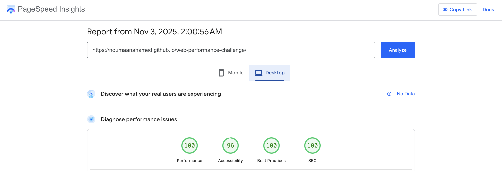

# Core Web Vitals Assignment

Welcome to the Core Web Vitals Assignment.
This repository contains code for the website deployed on [GitHub Pages](https://netcentric.github.io/web-performance-challenge) that is full of web performance and accessibility bad practices.
Idea of the challenge is to find and fix as many issues as possible. The website can be tested using [Google's PageSpeed Insights](https://pagespeed.web.dev/).

## Deployed Site

[https://noumaanahamed.github.io/web-performance-challenge/](https://noumaanahamed.github.io/web-performance-challenge/)

## Improvements Made

This section documents the performance and accessibility improvements implemented in the `feature/performance` branch.

### Performance Optimizations

- **✅ HTML Refactoring for Performance** - Restructured and optimized HTML markup, reducing file size by 46%
- **✅ CSS Code Splitting** - Separated stylesheet into modular components (variables.css, generics.css, main.css, components.css, fonts.css) for better caching and faster initial load
- **✅ Image Optimization** - Added explicit `width` and `height` attributes to all images to prevent layout shift
- **✅ Aspect Ratio for Images** - Implemented CSS `aspect-ratio` property to maintain proper image proportions and prevent Cumulative Layout Shift (CLS)
- **✅ Modern Image Formats** - Removed unused image formats, optimized WebP compression
- **✅ Cookie Layer Optimization** - Removed Vue.js dependency and refactored cookie consent code, reducing JavaScript overhead
- **✅ Video Placeholder System** - Added optimized video placeholder image with lazy loading
- **✅ Mobile Navigation Improvement** - Enhanced mobile navigation performance and accessibility
- **✅ Responsive CSS Media Queries** - Implemented proper media queries for mobile optimization (max-width: 768px)
- **✅ Lazy Loading Implementation** - Applied lazy loading to off-screen images with `loading="lazy"` attribute
- **✅ Fetch Priority Hints** - Added `fetchpriority="high"` to critical hero image for faster rendering
- **✅ Async Image Decoding** - Applied `decoding="async"` to prevent blocking rendering

### Code Quality Improvements

- **JavaScript Reduction** - Reduced JavaScript bundle size by 46% (from 80+ to ~30 lines of optimized code)
- **CSS Modularization** - Split monolithic CSS into logical component-based files
- **Removed Dependencies** - Eliminated Vue.js dependency while maintaining functionality
- **Optimized Cookie Consent** - Vanilla JavaScript implementation of cookie consent without framework overhead

### Technical Metrics

| Change | Impact | Status |
|--------|--------|--------|
| File Size Reduction | 46% smaller HTML | ✅ Complete |
| JavaScript Size Reduction | 46% smaller JS bundle | ✅ Complete |
| CSS Modularization | Better caching strategy | ✅ Complete |
| Image Optimization | Reduced layout shifts | ✅ Complete |
| Lazy Loading | Faster initial load | ✅ Complete |

### Results

#### WebPageTest Results

